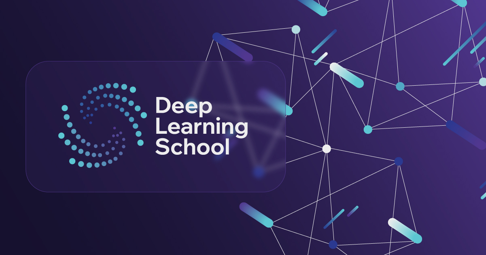

## Материалы модуля 11

  

### Генеративно-состязательные сети

### Лекция
В данной лекции вы познакомитесь с понятием генеративно-состязательных сетей и какие основные проблемы такого вида моделей и что такое Wasserstein-GAN. Также изучите архитектуру StyleGAN и StyleGAN-2. Затем посмотрите, что такое CycleGAN, VQGAN и как использовать генеративно-состязательные сети для генерации синтетических данных.

Занятие ведёт Нина Коновалова.

### Семинар
Данный семианр состоит из двух основных частей. 

1. В первой части вам продемонстируют работу генеративно-состязательной сети на практике.

    Занятие ведёт Артём Ямалутдинов

2. Во второй чати вы познакомитесь подробнее с понятием инверсии StyleGAN-2 с помощью оптимизации и encoder-based подходом и зачем это нужно.

Занятие ведёт Нина Коновалова.

### Домашнее задание

Данное домашнее задание состоит из двух основных частей:

1. Обучение GAN модели

2. Решение задачи StyleCLIP с помощью оптимизации

